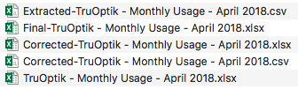

# videology
Python script that pulls data from a Videology Report and categorizes them
## Libraries used:
- *openpyxl* - https://pypi.org/project/openpyxl/ (pip install openpyxl)
- *pyexcel.cookbook* (pip install pyexcel)
- *csv, os, re*

Note: this was written with Jupyter Notebook, in an iPython notebook file, so for best results load the .ipynb file into the notebook environment and go from there
(http://jupyter.org/install.html)

This program creates several files during its iteration. This is to facilitate reading and writing. CSVs are better for writing and 
excel files are better for reading. Ignore the warning when opening the final excel file. It has proven to not change the values

